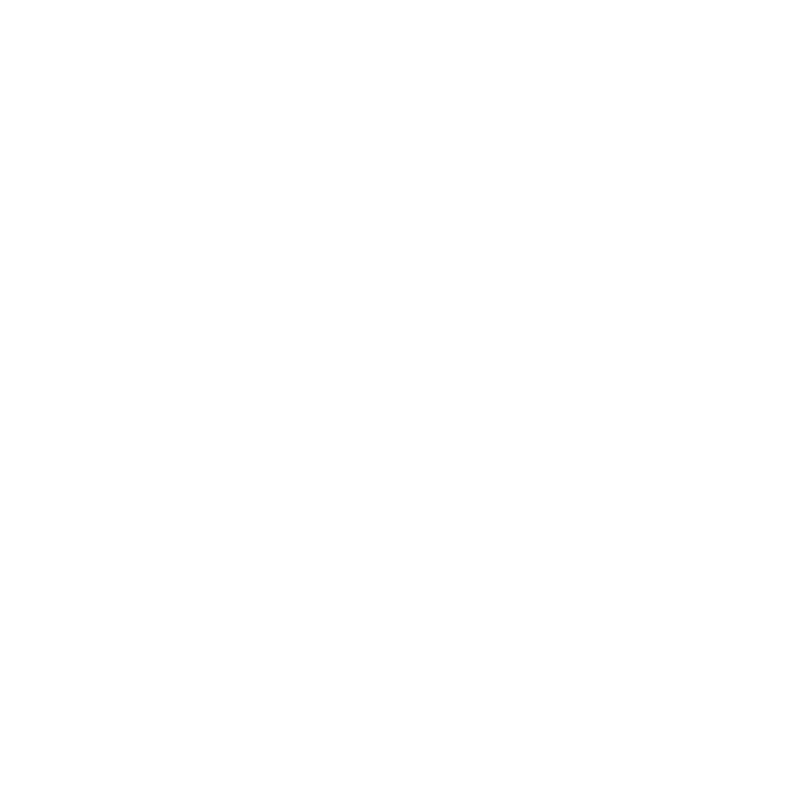
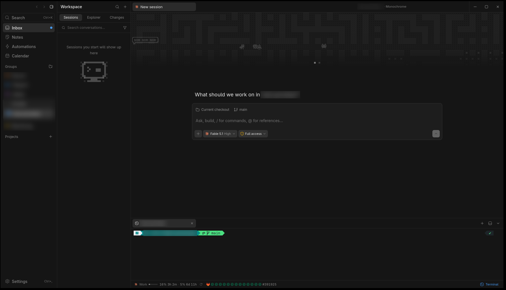
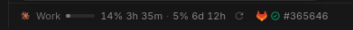
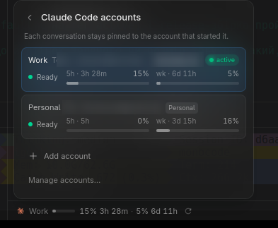

<p align="center">
  
</p>

<h1 align="center">Monochrome</h1>

<p align="center">
  <strong>A personal fork of MonoCode, tuned for Linux and GitLab-based work.</strong>
</p>

<p align="center">
  
</p>

MonoCode is a desktop app that runs the coding agents you already pay for (Claude Code, Codex, Cursor and others) in tabs. Monochrome is the same app with the changes below. It follows upstream closely and pulls its updates regularly.

## What is different

**GitLab, not only GitHub**
- The *Create PR* button creates a GitLab merge request when the repository lives on GitLab. It uses `glab` if you are logged in, otherwise the GitLab token from Settings → Inbox.
- The footer shows the latest CI pipeline of the current branch: one mark per stage, the pipeline number, and a panel with every job and a link to it.

  

- SSH remotes on a different host than the web UI (for example `git.example.com` vs `gitlab.example.com`) are recognised, for both merge requests and the Inbox.
- Generated commit messages and merge request descriptions follow the project's own instructions first, stay short, and never carry AI co-author or "Generated with" lines.

**Linear**
- Issue IDs such as `[OPS-42]` found in your commit subjects or branch name go into the merge request title, with a `Refs` line in the description, so Linear links them.
- A sprint calendar with planned hours, and a *Plan week* panel that turns a week's plan into Linear issues. Every planned item gets a label.
- Calendar cards and the issue panel flag what a hygiene report would: no due date, label, estimate or description, overdue, stale for a week. Closing an issue asks for a closing comment.
- Finished issues show a green check in the Inbox; red is kept for canceled ones.

**Agent chat**
- `! command` in the composer, and the *Run* button on shell blocks and `! command` blocks in a reply, run the command in a real terminal, so logins and `sudo` prompts work. The agent is told the exit status, never the output.
- When a reply ends with a question, *Yes* and *No* buttons under it send the answer in one click.
- `/rc` continues a Claude chat from a phone with Remote Control.
- *Auto* in the composer lets a small model pick the model for a new task; a model you picked by hand is never switched.

**Project knowledge**
- Each project has a `.monochrome` folder, kept out of git, with owner notes, what agents learned, an infrastructure map (hosts, services, access, checks) and a change log. Agents read it at the start of a session and keep it up to date.
- The *Diagram* tab shows the interactive architecture page an agent renders with the [Archify](https://github.com/tt-a1i/archify) skill, and can ask an agent to draw or update it.

**Editor**
- Highlighting for Terraform, Ansible and Jinja, with findings from external linters shown in the editor, and `govulncheck` after a commit in Go projects.

**Accounts**



- A Claude or Codex profile can point at an existing config directory instead of a fresh one.
- The account picker hides the default profile when another profile is the same sign-in, and marks the active one with a green *active* tag.

**Teleport**
- With `tsh` installed and logged in, Settings → Connections → Add machine lists the nodes of your Teleport clusters. Pick a node and a login; the remote host is set up over OpenSSH through `tsh proxy ssh`, with the certificate and known hosts `tsh config` provides. An expired certificate shows the `tsh login` command to run.

**Linux desktop**
- Transparent window, resizing from the window edges on Wayland, a Nerd Font in the terminal for Powerlevel10k, and a sharper monospace font.
- An OLED theme: a pure black page with transparency off, neutral text below full brightness, and every color mapped to pure red, green, red+green or blue, so it lights as few subpixels as possible.
- Releases are Linux-only (deb, rpm, AppImage), and the app checks this repository for new versions.
- Pasting images and files from the clipboard, and a PDF viewer (upstream pull requests #479 and #383, merged early).
- A container build for Manjaro (`Dockerfile.manjaro`).

## Build and install (Linux)

Needs Node.js 20+, a stable Rust toolchain and the system WebKitGTK 4.1 packages. A native build avoids the EGL errors the upstream AppImage hits on recent Mesa.

```bash
npm ci
npm run tauri build -- --no-bundle
install -Dm755 target/release/monocode ~/.local/bin/monochrome
```

Or build in a container: `docker build -f Dockerfile.manjaro --target artifact --output type=local,dest=./out-docker .`

Settings and data stay in the same place as MonoCode's, so switching between the two keeps your accounts and sessions.

## Keeping up with upstream

```bash
scripts/sync-upstream.sh            # merge upstream/main, then run the checks
scripts/sync-upstream.sh --install  # same, then rebuild and install
```

The script merges `upstream/main` into the current branch. If there is a conflict it has not seen before, it stops and lists the files, leaving the tree untouched; conflicts resolved once are replayed automatically next time. It never pushes.

## License

[MIT](LICENSE), as upstream; the original copyright stays with the MonoCode author. Provider names and logos are trademarks of their owners, see [NOTICE](NOTICE).
